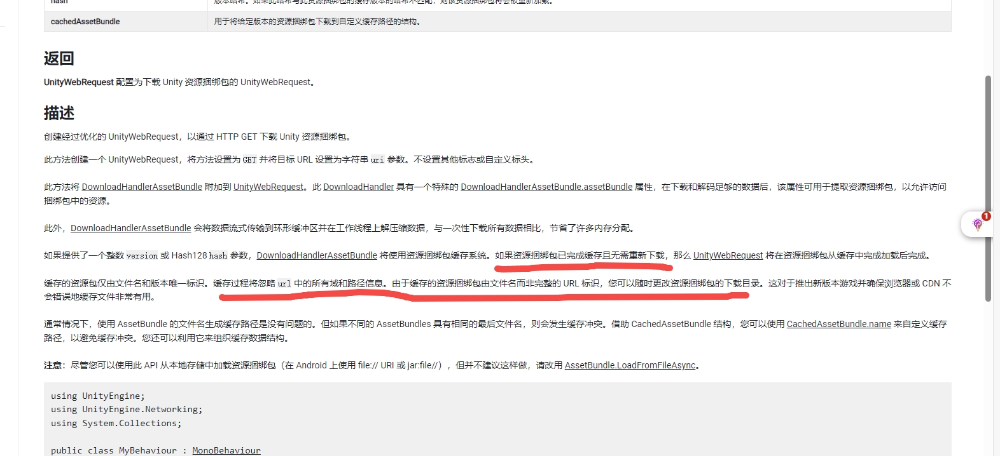
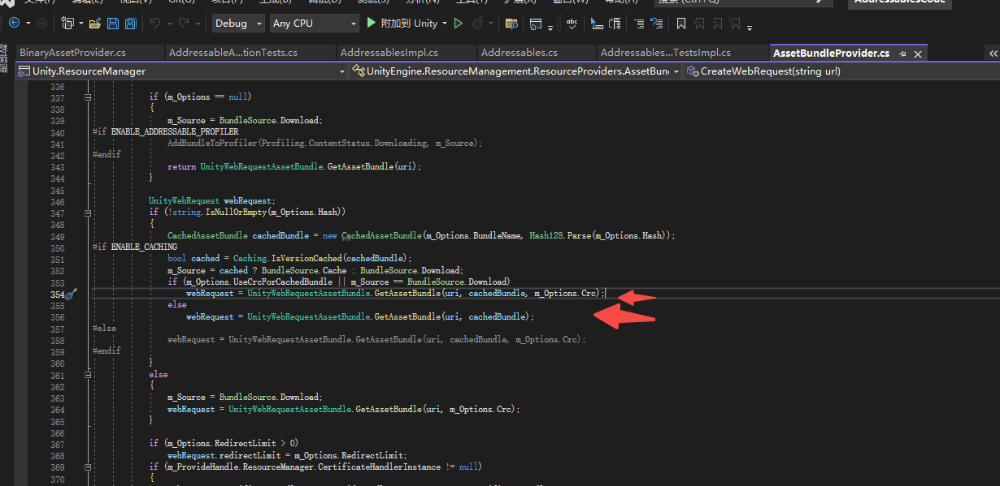
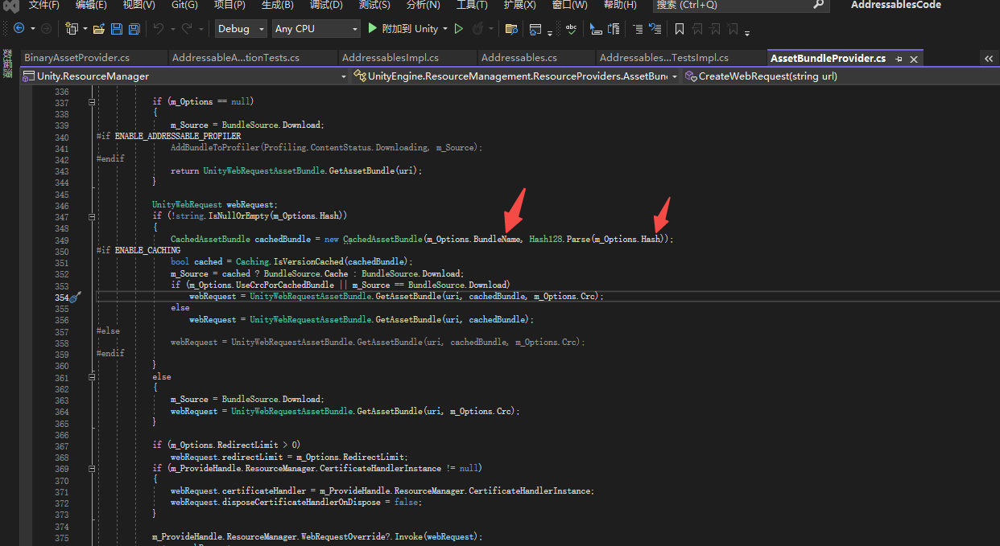
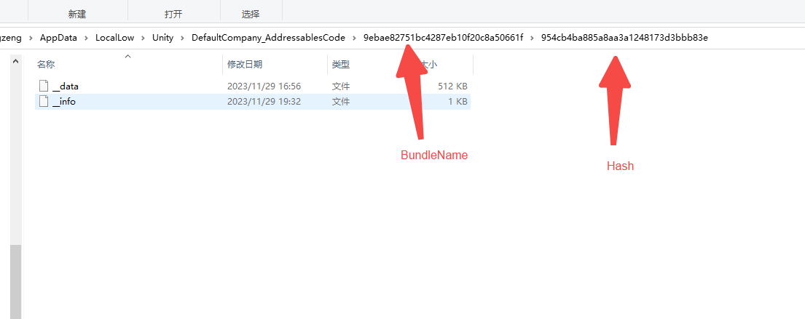
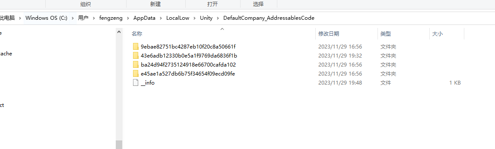
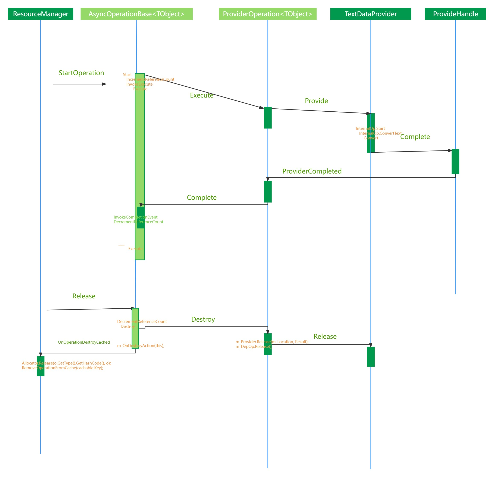

# learn.unity_addressable
学习Addressables 

[【游戏开发探究】Unity Addressables资源管理方式用起来太爽了，资源打包、加载、热更变得如此轻松（Addressable Asset System | 简称AA）](https://blog.csdn.net/linxinfa/article/details/122390621)

[Addressables package](https://docs.unity3d.com/Packages/com.unity.addressables@1.21/manual/index.html)

[AssetStudio 解压AssetBundle工具](https://github.com/Perfare/AssetStudio)

[Addressables之配置 - 知乎 (zhihu.com)](https://zhuanlan.zhihu.com/p/499172933)

[Unity Addressables学习 - 知乎 (zhihu.com)](https://www.zhihu.com/column/c_1499730067991793664)

[Addressables Runtime源码学习之总览 - 知乎 (zhihu.com)](https://zhuanlan.zhihu.com/p/512097761)

|                                                       |                                                              |
| ----------------------------------------------------- | ------------------------------------------------------------ |
| UnityEditor.EditorUserBuildSettings.activeBuildTarget | StandaloneWindows64                                          |
| Application.consoleLogPath                            | C:/Users/fengzeng/AppData/Local/Unity/Editor/Editor.log      |
| Application.dataPath                                  | E:/zengfeng/githubs/learn.unity_addressable/AddressablesCode/Assets |
| Application.persistentDataPath                        | C:/Users/fengzeng/AppData/LocalLow/DefaultCompany/AddressablesCode |
| Application.streamingAssetsPath                       | E:/zengfeng/githubs/learn.unity_addressable/AddressablesCode/Assets/StreamingAssets |
| Application.temporaryCachePath                        | C:/Users/fengzeng/AppData/Local/Temp/DefaultCompany/AddressablesCode |
| Addressables.RuntimePath                              | Library/com.unity.addressables/aa/Windows                    |
| Addressables.BuildPath                                | Library/com.unity.addressables/aa/Windows                    |
|                                                       |                                                              |

宏

| ENABLE_ADDRESSABLE_PROFILER | 性能监控       |
| --------------------------- | -------------- |
| ADDRESSABLES_LOG_ALL        | 日志           |
| ENABLE_BINARY_CATALOG       | 启用二进制目录 |
|                             |                |
|                             |                |

#### C#条件属性和宏定义

[c# Conditional用法详解_conditional c#-CSDN博客](https://blog.csdn.net/fdyshlk/article/details/77603287)

#### C#永久的不被垃圾回收

[编程小知识之 GC.KeepAlive-CSDN博客](https://blog.csdn.net/tkokof1/article/details/92073033)

#### 对象池 LRU-least recently used-最近最少使用算法，是一种内存数据淘汰策略

[LRU原理与算法实现 - 知乎 (zhihu.com)](https://zhuanlan.zhihu.com/p/161269766)

#### UnityWebRequestAssetBundle.GetAssetBundle 读本地缓存和下载远程

https://docs.unity.cn/cn/2019.4/ScriptReference/Networking.UnityWebRequestAssetBundle.GetAssetBundle.html

#### Bundle缓存目录关系

# 源码笔记

### 异步操作

[AssetDatabase InitalizationObjectsOperation-ProcessOn](https://www.processon.com/diagraming/655f334f33955724ba6bf8f9)

[AssetDatabase.ProvideResource ResourceManagerRuntimeData-ProcessOn](https://www.processon.com/diagraming/655f007d4cdeeb0fc3624a7d)

struct AsyncOperationHandle<TObject> : IEnumerator, IEquatable<AsyncOperationHandle<TObject>>

struct AsyncOperationHandle : IEnumerator

interface IAsyncOperation

class AsyncOperationBase<TObject> : IAsyncOperation

class ChainOperation<TObject, TObjectDependency> : AsyncOperationBase<TObject>

 class ChainOperationTypelessDepedency<TObject> : AsyncOperationBase<TObject>

class GroupOperation : AsyncOperationBase<IList<AsyncOperationHandle>>, ICachable

internal class UnityWebRequestOperation : AsyncOperationBase<UnityWebRequest>

internal class ProviderOperation<TObject> : AsyncOperationBase<TObject>, IGenericProviderOperation, ICachable

### 提供操作

interface IResourceProvider

struct ProvideHandle

 public abstract class ResourceProviderBase : IResourceProvider, IInitializableObject

 public class ContentCatalogProvider : ResourceProviderBase

 public class AssetBundleProvider : ResourceProviderBase

 public class AssetDatabaseProvider : ResourceProviderBase

public class AtlasSpriteProvider : ResourceProviderBase

 internal class BinaryDataProvider : ResourceProviderBase

public class BundledAssetProvider : ResourceProviderBase

public class LegacyResourcesProvider : ResourceProviderBase

 public class VirtualAssetBundleProvider : ResourceProviderBase, IUpdateReceiver

 public class VirtualBundledAssetProvider : ResourceProviderBase

public class TextDataProvider : ResourceProviderBase

